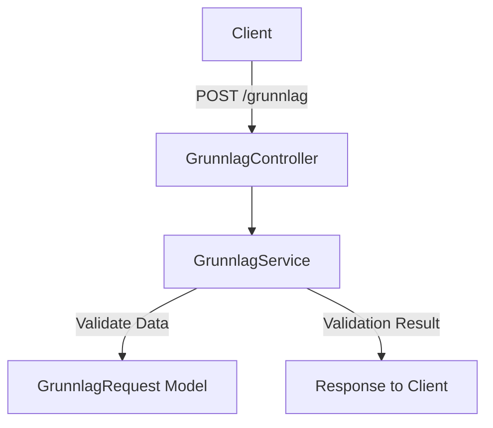

# Hiring Process: Developer with Test Responsibility

## Code Task: Create a REST API with a Simple Service Structure and Focus on Testing

### Scenario:

The Norwegian Tax Administration (Skatteetaten) works with systems that receive and process large amounts of data from external actors. We want you to develop a small REST API that simulates such a data flow.

### Task:

Create a simple REST service consisting of:
- A `POST /grunnlag` endpoint that receives JSON data.
- The data should be forwarded to a service class for processing.
- The functionality of the service is not important – but it should exist and be tested.

### Requirements:

- Java or Kotlin.
- You are free to choose frameworks and testing frameworks.
- It is expected that both the controller and service are tested.
- If the sums for `saldo` and `aksjeandel` match `sumSaldo` and `sumAksjehandel` respectively, return status `200`, otherwise status `400`.
- Otherwise, you are free to choose how to solve the task.

### Delivery:

- Source code in a Git repository (GitHub, GitLab, or similar).
- A `README` file briefly describing your test philosophy:
  - What you chose to test, how you did it, and why.

### How the Application Works

1. **Client Request**: The client sends a `POST` request to the `/grunnlag` endpoint with a JSON payload containing data about the submitter, tasks, and task summary.
2. **Controller**: The `GrunnlagController` receives the request and forwards the data to the `GrunnlagService` for processing.
3. **Service Validation**: The `GrunnlagService` validates the data by checking if the sums of `saldo` and `aksjeandel` match `sumSaldo` and `sumAksjehandel` respectively.
4. **Response**: Based on the validation result, the application returns:
   - `200 OK` if the data is valid.
   - `400 Bad Request` if the data is invalid.

### Workflow Diagram



### Model:
#### JSON Example of Request:

```json
{
  "innsender": {
    "navn": "Ole Olsen",
    "foedselsnummer": "26063643458"
  },
  "oppgave": [
    {
      "saldo": 100,
      "aksjeandel": 200
    },
    {
      "saldo": 110,
      "aksjeandel": 210
    }
  ],
  "oppgaveoppsummering": {
    "sumSaldo": 210,
    "sumAksjehandel": 410
  }
}
```

#### JSON Schema:

```json
{
  "$schema": "http://json-schema.org/draft-04/schema#",
  "type": "object",
  "properties": {
    "innsender": {
      "type": "object",
      "properties": {
        "navn": {
          "type": "string"
        },
        "foedselsnummer": {
          "type": "string"
        }
      },
      "required": [
        "navn",
        "foedselsnummer"
      ]
    },
    "oppgave": {
      "type": "array",
      "items": {
        "type": "object",
        "properties": {
          "saldo": {
            "type": "integer"
          },
          "aksjeandel": {
            "type": "integer"
          }
        },
        "required": [
          "saldo",
          "aksjeandel"
        ]
      }
    },
    "oppgaveoppsummering": {
      "type": "object",
      "properties": {
        "sumSaldo": {
          "type": "integer"
        },
        "sumAksjehandel": {
          "type": "integer"
        }
      },
      "required": [
        "sumSaldo",
        "sumAksjehandel"
      ]
    }
  },
  "required": [
    "innsender",
    "oppgave",
    "oppgaveoppsummering"
  ]
}
```

## Running Tests

To run all tests (unit and integration):

```bash
mvn test
```
