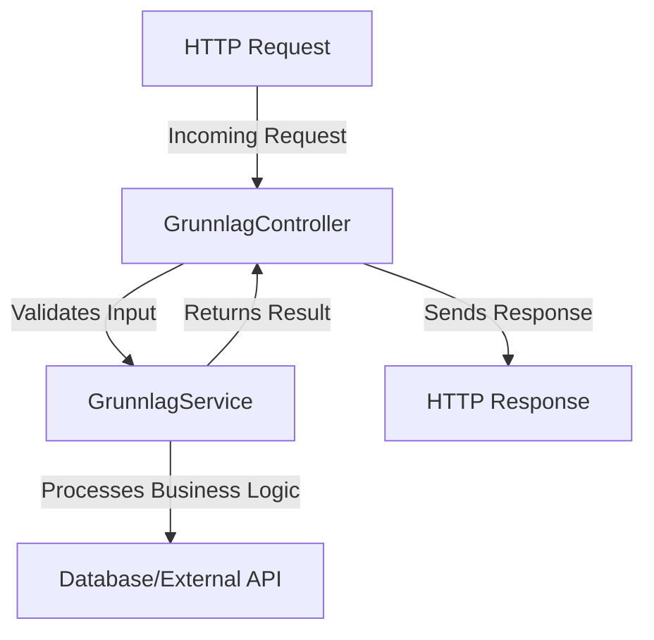

# Workflow of the Application

This document outlines the workflow of the application, detailing how the different layers interact and process requests.

## 1. **Request Handling (Controller Layer)**
- The application starts by receiving an HTTP request at the `GrunnlagController`.
- The controller performs the following tasks:
  1. Validates the incoming request payload using annotations like `@Valid`.
  2. Delegates the business logic to the service layer by calling the appropriate method in `GrunnlagService`.
  3. Returns an HTTP response to the client with the appropriate status code and response body.

## 2. **Business Logic (Service Layer)**
- The `GrunnlagService` is responsible for implementing the core business logic of the application.
- It performs tasks such as:
  1. Validating the data further if needed.
  2. Processing the data (e.g., calculations, transformations).
  3. Interacting with external systems or APIs if required.
- The service layer ensures that the application logic is reusable and independent of the controller.

## 3. **Data Representation (Model Layer)**
- The `GrunnlagRequest` class represents the structure of the incoming request payload.
- It includes nested classes like `Innsender`, `Oppgave`, and `OppgaveOppsummering` to model complex data structures.
- Validation annotations (e.g., `@NotNull`, `@Size`) ensure that the data adheres to the required constraints.

## 4. **Configuration and Resources**
- The `application.properties` file contains configuration settings for the application, such as server port and logging levels.
- The `json/schema.json` file defines the JSON schema used to validate incoming requests.
- The `json/request.json` file provides sample request data for testing and development purposes.

## 5. **Testing Workflow**
- The application is thoroughly tested using unit and integration tests:
  1. **Unit Tests**:
     - Test individual components like `GrunnlagService` and `GrunnlagController` in isolation.
     - Use mocking frameworks like Mockito to simulate dependencies.
  2. **Integration Tests**:
     - Test the interaction between layers, ensuring that the application works end-to-end.
     - Use Spring Boot's `@SpringBootTest` and `MockMvc` for integration testing.
  3. **Model Tests**:
     - Validate the behavior of the `GrunnlagRequest` model, including its nested classes and validation annotations.

## 6. **Build and Deployment**
- The application is built using Maven, with the `pom.xml` file defining dependencies and build configurations.
- The compiled application is packaged as a JAR file (`demo-0.0.1-SNAPSHOT.jar`) and can be deployed to a server.

## 7. **Logging and Monitoring**
- Logging is configured in the `application.properties` file to capture application events and errors.
- Logs can be used to monitor the application's behavior and troubleshoot issues.

## 8. **Error Handling**
- The application uses exception handling mechanisms to:
  1. Return meaningful error messages to the client (e.g., `400 Bad Request` for validation errors).
  2. Log errors for debugging and analysis.

This workflow ensures that the application is modular, maintainable, and testable, adhering to best practices in backend development.